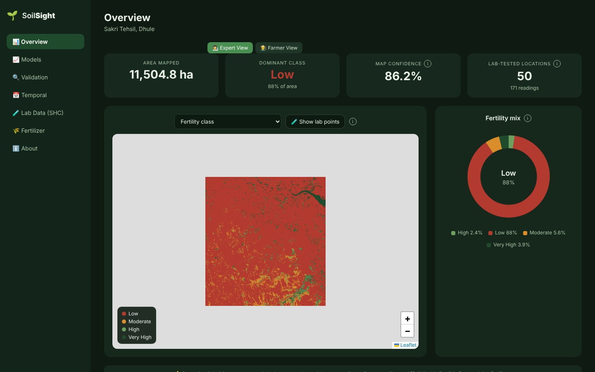
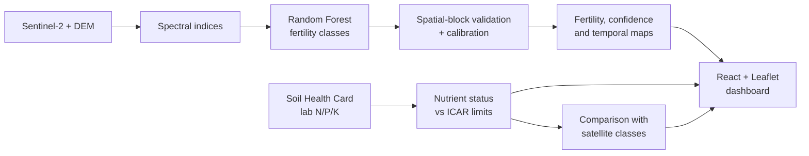
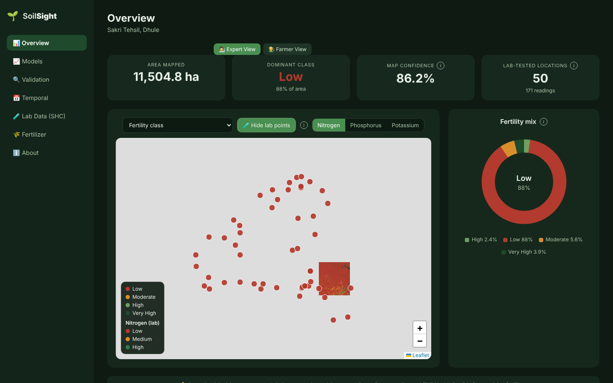
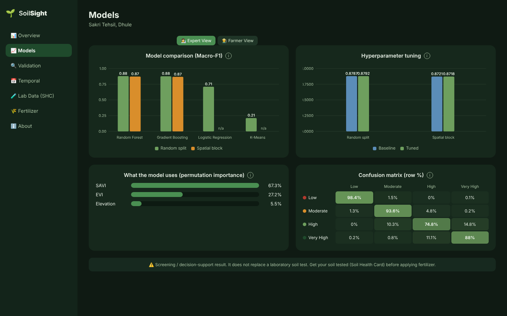
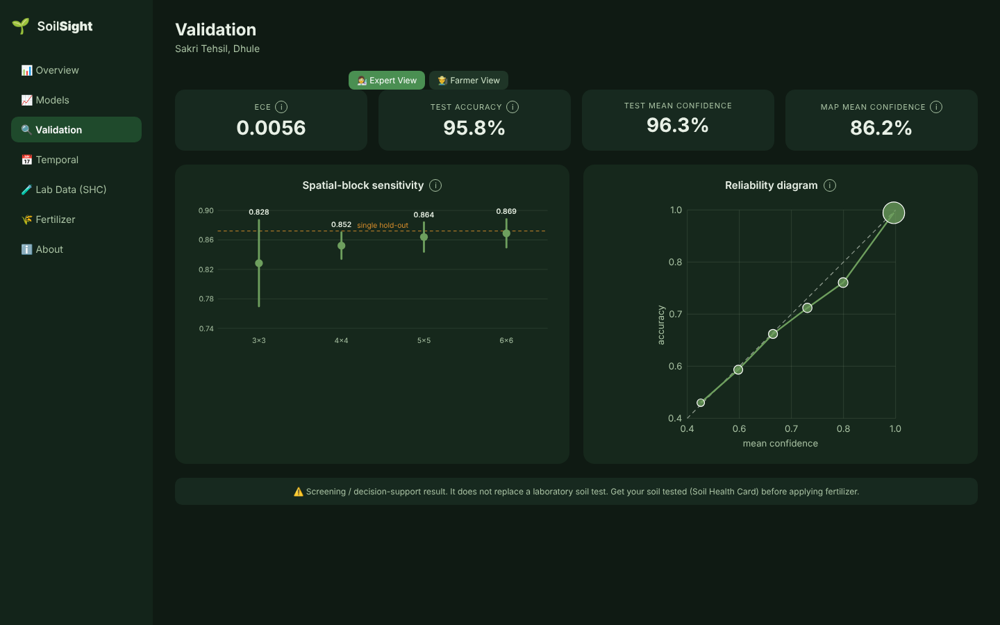
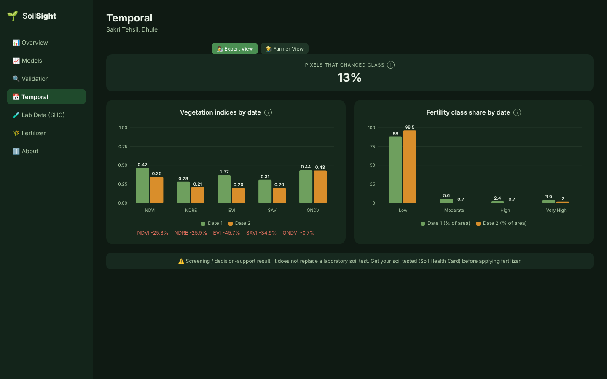
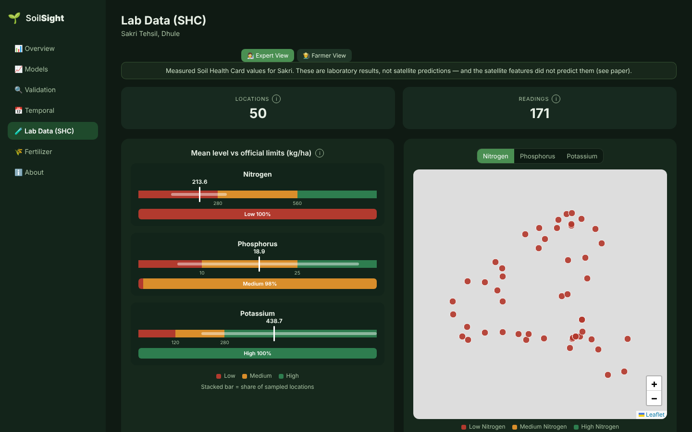
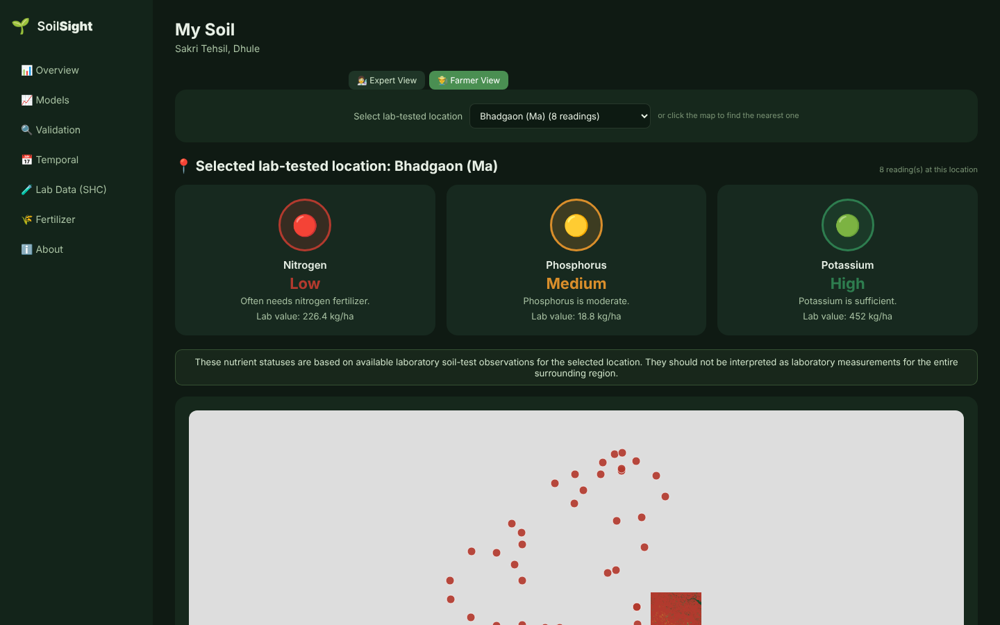

<div align="center">

# 🌱 SoilSight

### Soil Nutrient Deficiency Mapper
**Satellite-based soil fertility screening + lab-measured Soil Health Card nutrient status**
for **Sakri Tehsil, Dhule, Maharashtra, India**


<br/>



</div>

---

## ✨ At a glance

| | |
|---|---|
| 🛰️ **Data** | Sentinel-2 L2A (B02, B03, B04, B05, B08) + Copernicus 30 m DEM |
| 🌾 **Indices** | NDVI · NDRE · EVI · SAVI · GNDVI |
| 🤖 **Models** | Random Forest (primary) · Gradient Boosting · Logistic Regression · K-Means baseline |
| 🔍 **Validation** | Random split **vs** spatial-block hold-out, with grid-size sensitivity (3×3 → 6×6) |
| 🧪 **Lab data** | 171 Soil Health Card readings · 50 locations · 41 villages in Sakri Tehsil |
| 🗺️ **Dashboard** | React + react-leaflet · Expert view and a plain-language Farmer view |

> ### ⚠️ Read this first
> - Vegetation indices **do not measure** soil N, P or K.
> - Phase 1 fertility classes are **proxy labels** derived from remote-sensing thresholds, not laboratory fertility.
> - Model **confidence ≠ accuracy**, and a high random-split score is not proof of skill.
> - SoilGrids is a **modelled reference layer**, not laboratory ground truth. **CEC is not potassium.**
> - The fertilizer table is an **illustrative heuristic**, not validated against laboratory data or current MPKV/Maharashtra recommendations.
> - This is a **screening / decision-support** tool. It does not replace a laboratory soil test.

---

## 🧭 Pipeline



---

## 🖼️ Dashboard tour

<table>
<tr>
<td width="50%"><b>🧪 Lab points on the map</b><br/></td>
<td width="50%"><b>📈 Model comparison</b><br/></td>
</tr>
<tr>
<td width="50%"><b>🔍 Validation &amp; calibration</b><br/></td>
<td width="50%"><b>📅 Temporal analysis</b><br/></td>
</tr>
<tr>
<td width="50%"><b>🧫 Lab data vs official limits</b><br/></td>
<td width="50%"><b>👨‍🌾 Farmer view</b><br/></td>
</tr>
</table>

---

## 📊 Key findings (Sakri case study)

| Finding | What it shows |
|---|---|
| **Label leakage found and removed** | An early model scored perfectly because the labels were built from NDVI / soil-moisture thresholds. The final model uses EVI + SAVI + Elevation. |
| **Spatial validation changes the story** | Random split Macro-F1 **0.879** vs spatial-block **0.872** (single hold-out). Over repeated 4×4 blocks it is **0.852 ± 0.018**, and it varies with block size. |
| **Tuning did not help** | Hyperparameter search gave negligible gain (random 0.8787 → 0.8792, spatial 0.8721 → 0.8718). |
| **Calibration** | ECE = **0.0056** on in-distribution test data against proxy labels only. |
| **Season matters** | Predicted classes shift between a monsoon date and a post-harvest date, mostly reflecting crop growth stage. |
| **Satellite features do not predict lab N/P/K** | Negative R² under grouped validation. This is reported as a **negative result**. |
| **Lab data shows a different picture** | Sampled Sakri locations are all Low in available N and High in available K by ICAR limits, with most Medium in P. A zone-based fertilizer table cannot capture that. |

---

## 🚀 Quick start

**Run the dashboard**

```bash
cd dashboard
npm install
npm run dev          # http://localhost:5173
```

All numbers on the dashboard are read from JSON files in `dashboard/public/`. None are typed into the UI code, and the charts are plain SVG (no chart library).

**Reproduce the analysis**

```bash
# 1. add Sentinel Hub credentials (never commit this file)
#    .env
#    SH_CLIENT_ID=your-client-id
#    SH_CLIENT_SECRET=your-client-secret

# 2. fetch imagery and DEM, compute indices
python fetch_sakri_imagery.py
python fetch_elevation.py
python compute_all_indices.py

# 3. train, validate, analyse
python train_and_save_clean_model.py
python spatial_sensitivity_and_calibration.py
python shc_nutrient_status.py
```

<details>
<summary><b>📁 Repository layout (click to expand)</b></summary>

| Area | Scripts |
|---|---|
| Data acquisition | `fetch_sakri_imagery.py`, `fetch_sakri_date2.py`, `fetch_elevation.py`, `fetch_sakri_npk_region_*.py`, `fetch_soilgrids*.py`, `sentinel_config.py` |
| Indices | `compute_all_indices.py`, `compute_indices_date2.py`, `compute_indices_npk_region*.py`, `generate_index_overlays.py` |
| Fertility model | `train_model.py`, `train_and_save_clean_model.py`, `ablation_study.py`, `hyperparameter_tuning.py`, `baseline_logreg.py`, `kmeans_baseline.py`, `gradient_boosting_comparison.py` |
| Validation | `spatial_validation.py`, `spatial_sensitivity_and_calibration.py`, `confidence_layer.py`, `explainability.py`, `sanity_check.py` |
| Prediction and maps | `predict_real_raster.py`, `generate_maps.py`, `fertilizer_map*.py`, `export_geotiff.py` |
| Temporal | `compare_temporal_indices.py` |
| SHC / N-P-K | `extract_features_at_npk_points*.py`, `train_npk_regression*.py`, `npk_variance_diagnostic.py`, `shc_nutrient_status.py`, `shc_validation_and_interpolation.py`, `export_npk_points.py` |
| Data investigation | `inspect_wosis*.py`, `clean_wosis_nitrogen.py` |
| Dashboard data export | `generate_dashboard_data.py`, `generate_model_evaluation.py`, `update_dashboard_soilgrids.py`, `audit_dashboard_data.py` |
| Dashboard | `dashboard/` |

</details>

<details>
<summary><b>🔐 Data and credentials (click to expand)</b></summary>

- Sentinel Hub credentials are **not** stored in the repo. Put them in a git-ignored `.env`.
- Large or non-redistributable data is git-ignored: raw Sentinel-2/DEM rasters, `.npy` arrays, trained `.pkl` models, WoSIS extracts and most `.csv` files. Regenerate them with the scripts above.
- Dependencies used: numpy, pandas, scikit-learn, scipy, matplotlib, rasterio, pyproj, sentinelhub, joblib, python-dotenv, requests.

</details>

---

## ⚠️ Limitations

- Single study area (Sakri Tehsil): a regional case study, with no claim of generalisation.
- Phase 1 labels are proxy labels, so accuracy figures describe agreement with those proxies.
- Calibration was measured on in-distribution test data against proxy labels only.
- Only 50 laboratory locations are available, which is too few for reliable N/P/K regression.
- Satellite-derived classes are sensitive to acquisition date and to domain-shift correction.

## 🗺️ Roadmap

- [x] Phase 1: satellite fertility mapping with spatial validation
- [x] Lab Soil Health Card N/P/K integration and negative-result analysis
- [x] Interactive dashboard with Expert and Farmer views
- [ ] More laboratory samples for Phase 2 N/P/K modelling
- [ ] Verify fertilizer rules against current MPKV / Maharashtra recommendations
- [ ] Extra acquisition dates for multi-season analysis

## 📄 Licence

MIT, see [`LICENSE`](LICENSE).
